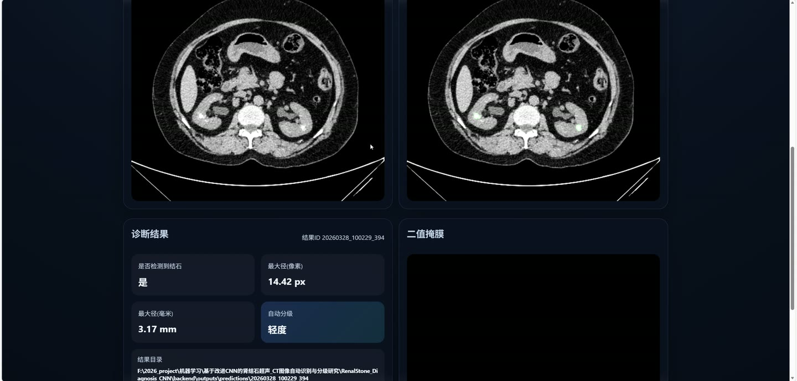
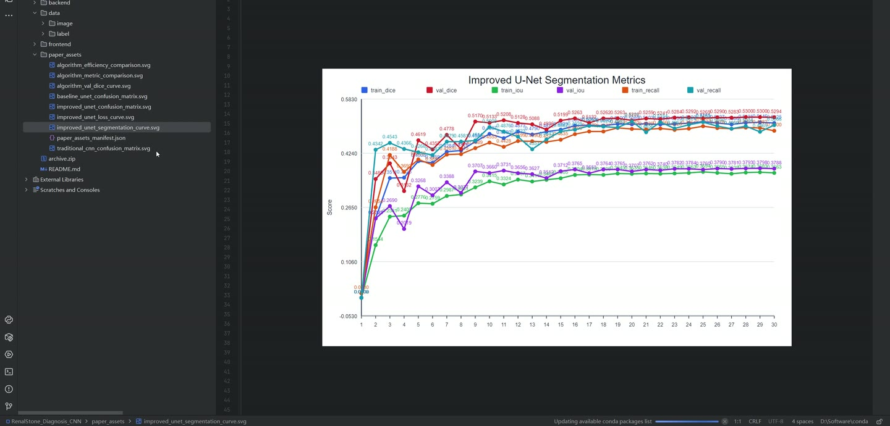
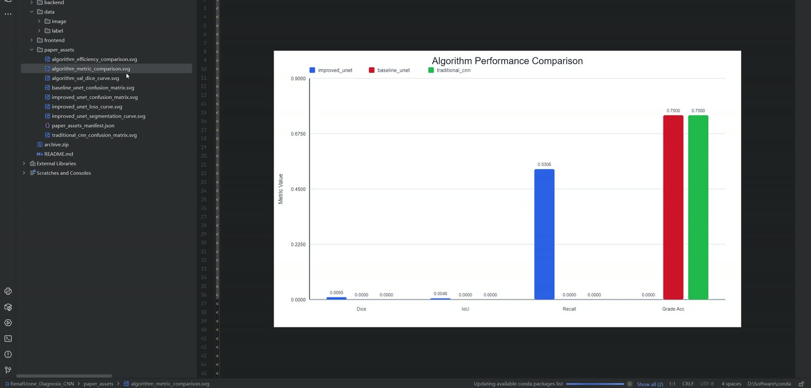
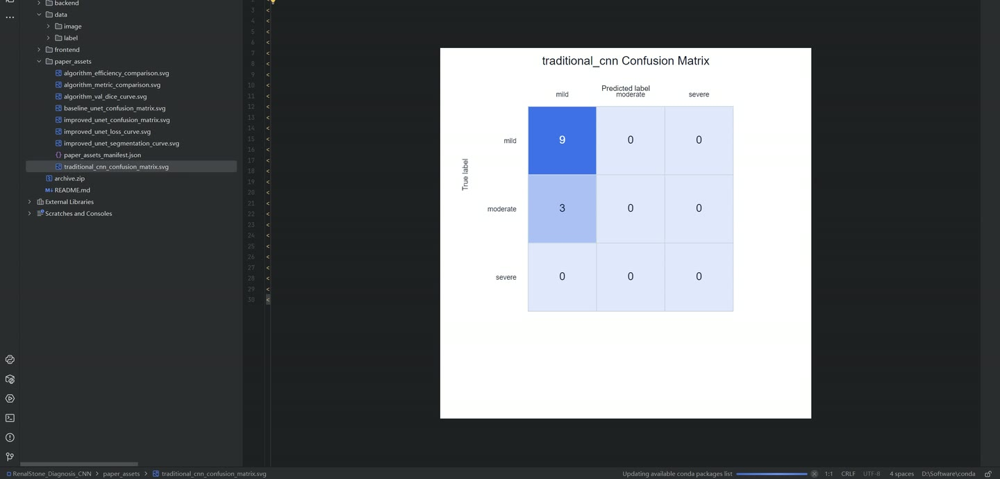
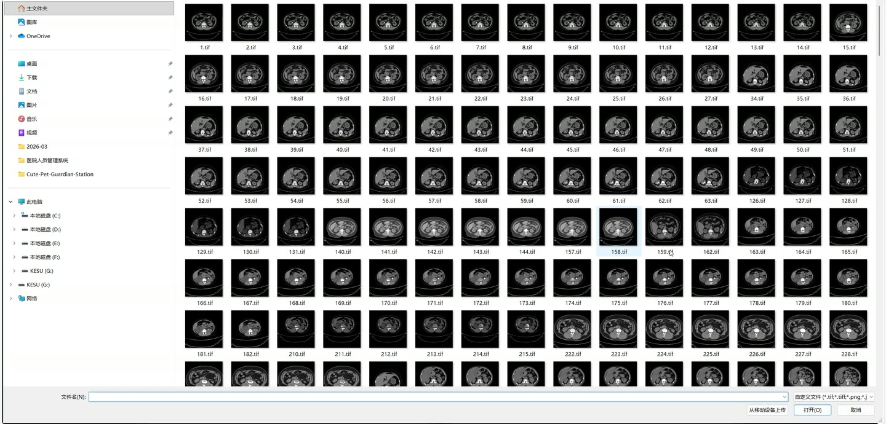

# (附文档)Python+深度学习+PyTorch 基于改进CNN的肾结石超声_CT图像自动识别与分级研究

**技术栈**：Python、FastAPI、PyTorch、深度学习、Vue3

### 系统简介

本系统是一套基于改进 CNN 的肾结石超声/CT 图像自动识别与分级平台，采用前后端分离架构。后端基于 FastAPI 提供推理与训练接口，前端基于 Vue3 实现图像导入、分割叠加显示、最大径测量与轻中重度自动分级。系统包含普通用户端与管理员端两类角色。
 
### 核心功能
 
### 普通用户端

- 上传待分析图像，支持 .tif、.tiff、.png、.jpg、.jpeg、.bmp 格式，上传后自动生成本地预览。

- 选择成像模态，可在通用、CT、超声三种模式间切换，不同模态对应不同预处理策略。

- 设置像素间距（mm/px），用于将像素级最大径换算为毫米级实际尺寸。

- 调整分割阈值，范围 0.1 至 0.9，用于控制掩膜二值化灵敏度。

- 配置 API 地址，可自定义后端服务地址并随时刷新模型状态。

- 查看模型状态面板，展示模型是否已加载、运行设备、最佳轮次与最佳 Val Dice。

- 提交诊断请求，前端将图像、模态、像素间距、阈值封装为表单发送至推理接口。

- 查看原始图像与分割叠加结果，叠加图以高亮形式标注结石区域。

- 查看二值掩膜图，独立展示模型输出的结石分割掩膜。

- 查看诊断结果，包括是否检测到结石、最大径像素值、最大径毫米值、自动分级与置信度。

- 自动分级结果以轻度、中度、重度中文形式展示，便于快速判读。

- 下载分割叠加图，文件名以结果 ID 命名。

- 下载二值掩膜图，便于后续存档或二次分析。

- 导出诊断报告，以 JSON 格式包含文件名、请求参数、模型信息、结果目录与诊断结论。

- 查看结果元信息，包括结果目录、模型权重路径与结果 ID。
 
### 管理员端

- 健康检查接口，返回服务状态、模型路径与模型信息。

- 查询模型信息，获取模型是否就绪、运行设备、检查点轮次与最佳 Val Dice。

- 重载模型，无需重启服务即可加载最新权重。

- 配置数据目录，统一管理图像目录、标签目录、检查点目录与输出目录。

- 管理预测结果存储，自动将每次推理的原图、叠加图、掩膜与报告写入预测目录。

- 执行模型训练，支持配置训练轮数、批大小、学习率、测试集比例与验证集比例。

- 选择训练模态，可在通用、CT、超声之间指定训练数据模态。

- 设置随机种子与早停耐心值，保证训练可复现并自动停止无效迭代。

- 自动划分训练集、验证集与测试集，按比例随机拆分配对样本。

- 训练过程记录损失、Dice、IoU 与召回率指标，并输出每轮 JSON 日志。

- 基于验证集 Dice 保存最佳检查点，包含模型权重、优化器状态与指标。

- 学习率自适应调整，验证指标停滞时自动衰减学习率。

- 训练结束后在测试集上评估并生成训练摘要 JSON 文件。
 
### 技术栈

后端框架FastAPI
深度学习框架PyTorch
网络结构ImprovedUNet
损失函数CombinedSegmentationLoss
优化器AdamW
学习率调度ReduceLROnPlateau
数据划分scikit-learn train_test_split
图像处理Pillow、NumPy
前端框架Vue3
前端语言TypeScript
构建工具Vite
评估指标Dice、IoU、Recall
 
### 交付内容

- 后端完整源码

- 前端完整源码

- 数据库初始化脚本

- 万字文档

## 界面展示

---

## 获取完整源码 + 万字文档

本仓库为项目介绍页。**完整前后端源码、数据库初始化脚本、万字项目文档**，请加微信 `kangkangcode`，或访问 [codekk.top](http://codekk.top) 获取。

可作课程设计 / 毕业设计参考，支持远程部署调试。